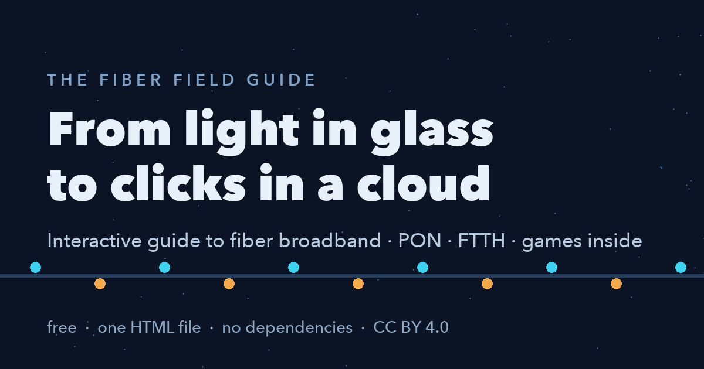

# 🌐 The Fiber Field Guide

**An interactive, ELI5-friendly field guide to fiber broadband — from photons in glass to the operator cloud.**

### ▶️ **[Open the guide → akhileshds1.github.io/fiber-field-guide](https://akhileshds1.github.io/fiber-field-guide/)**

One self-contained HTML file. No frameworks, no build step, no dependencies, no tracking. Open `index.html` and start playing.

## What's inside

| Chapter | What you get |
|---|---|
| 🔦 **The Light Lab** | Type a letter, fire the laser, watch its bits fly down the fiber as light pulses |
| 🏘️ **The PON Playground** | Animated OLT → splitter → homes diagram: broadcast downloads (with encryption 🔒), turn-taking uploads, and a fiber you can cut ✂️ |
| 🌈 **Colors on One Glass** | Toggle GPON/XGS-PON wavelengths flowing on one strand — why 10-gig overlays need no new fiber |
| 📐 **Optical Budget Calculator** | The real dBm math behind fiber planning: distance, splits, splices, dirty connectors, live link-health meter |
| 🧱 **The Broadband Stack** | Vendor-neutral tour: CPE → OLT/NOS → EMS → operator cloud |
| ☁️ **Reference Architecture** | Clickable layer-by-layer operations-cloud backend, each block with a tester's probe |
| ⛈️ **Alarm Storm** | Cut one fiber, watch 32 alarms correlate into one incident |
| 👨‍👩‍👧 **"Add Subscriber", end to end** | Animated 8-step walkthrough from order to confetti |
| 🧪 **The Troubleshooting Lab** | A game: 8 trouble tickets, click the broken component, learn blast-radius diagnosis |
| 🎓 **Quiz + Jargon Decoder** | 5-question check and a searchable glossary of ~50 industry terms with real usage sentences |

Every section has a 🖍️ *"Like you're five"* explanation, and every acronym on the page has a hover tooltip.

## Who it's for

- New hires at ISPs, fiber operators, and broadband vendors (this started as one engineer's onboarding notes)
- Network engineering students
- Support/QA/product folks who need the *concepts* without the ITU specs
- Anyone who's ever asked "but how does fiber actually work?"

## Use it

- **Read it:** open `index.html` in any modern browser (light/dark theme aware, reduced-motion friendly)
- **Teach with it:** present straight from the browser — the animations are the slides
- **Host it:** drop the file on any static host (GitHub Pages serves this repo as-is)
- **Remix it:** it's one file of vanilla HTML/CSS/JS — fork and make it yours

## Contributing

Spot a technical error, a better analogy, or a missing term? PRs and issues welcome.
Ground rules: keep it vendor-neutral, keep it one dependency-free file, keep the ELI5 spirit.

## License

[CC BY 4.0](https://creativecommons.org/licenses/by/4.0/) — share and adapt freely, with attribution.
